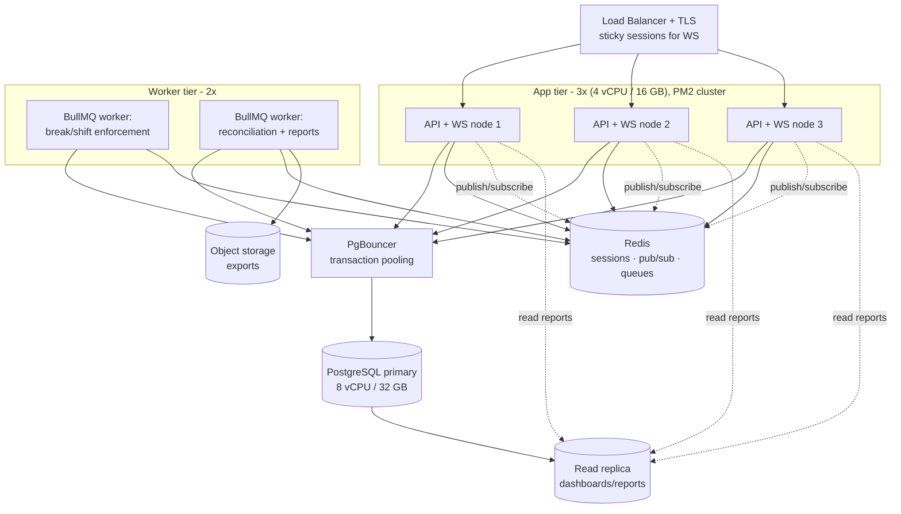

# Time Tracker Module — Enterprise Architecture (3,000 active employees)

This is the foundation module. It ports every rule from your prototype to a **server-authoritative**, horizontally-scalable backend, and it's designed so the leave and payroll modules plug into the same data and infrastructure later.

**Target load assumption:** in a BPO, "active" ≈ "concurrent at shift peak," so design point is **~3,000 simultaneous clocked-in users**, all holding a live WebSocket, with bursts of clock-ins at shift-start boundaries (e.g. 200–400 people clocking in within a few minutes).

---

## 1. The three decisions that make this scale

Everything else follows from these.

### (a) Server-authoritative time
The browser clock displays countdowns; it **never** decides anything. Elapsed shift time, "is the regular break unlocked (4h)?", "did this bio break exceed 5 min?" — all computed from `clock_in_at` and `break.started_at` columns the **server** wrote with `now()`. This is non-negotiable once time drives pay: a client clock can be changed; a server clock can't.

### (b) Deadline scheduling, not per-user timers
Your prototype runs `setInterval(tick, 1000)` in every browser to catch break overruns and the 8-hour shift expiry. The naïve server port — one timer per user — means **3,000 live timers** that vanish on restart and bloat memory. Instead:

> When a break starts, compute its hard deadline (`started_at + max_duration`) and **enqueue a single delayed job** in BullMQ scheduled for that exact moment. When the job fires, it checks the DB: if the break is still open, auto-logout; if the employee already ended it, the job no-ops. A periodic **reconciliation sweep** (every 30s) catches anything a Redis flush dropped.

This is O(overdue events), not O(users). It survives restarts because the deadline lives in PostgreSQL. The same pattern schedules the 8-hour shift expiry at clock-in. This is the single most important scaling choice in the module.

### (c) Stateless API + shared real-time bus
API nodes hold **no session state** (JWT access/refresh tokens; anything shared lives in Redis), so you can run N identical nodes behind a load balancer and add more under load. WebSockets scale via the **Socket.IO Redis adapter**: each employee joins a room `employee:{id}`, and a Team Lead's "grant" on *any* node publishes to that room through Redis, reaching the employee's socket on *whatever* node it's connected to.

---

## 2. Production topology



**Why each piece at 3k:**

| Component | Spec | Reasoning |
|---|---|---|
| App nodes | 3 × (4 vCPU / 16 GB) | ~1,000 sockets/node is trivial for Node; 3 nodes give redundancy (lose one, still serve everyone) + headroom. PM2 cluster mode uses every core. |
| Worker nodes | 2 × (2 vCPU / 8 GB) | Enforcement jobs are tiny and bursty (clock-in/break boundaries). Two nodes for HA; BullMQ distributes work. |
| **PgBouncer** | sidecar / small box | 3 app nodes × pooled connections will exhaust Postgres without it. Transaction-mode pooling keeps Postgres connections in the low hundreds regardless of app-node count. **Essential at this scale.** |
| PostgreSQL primary | 8 vCPU / 32 GB, NVMe | Write volume is modest (clock-ins, activity switches, break events, audit), but payroll later reads heavily — size for the whole platform. |
| Read replica | same class | Dashboards and "who's on break right now" live queries hit the replica, never competing with writes. |
| Redis | managed, 4 GB, HA | Sessions, Socket.IO pub/sub, BullMQ queues. One instance covers all three at this scale. |

You can start cheaper (2 app nodes, no replica) and add the replica + third node as you onboard. The architecture doesn't change — you just scale the tiers.

---

## 3. Data model highlights (see `prisma/schema.prisma`)

The schema turns your in-memory `S = {...}` state and `localStorage` keys into durable, indexed tables:

- **`TimeEntry`** is the shift window — `clockInAt` + the 8-hour absolute end. It stays `OPEN` (shift running in the background) even after a "logout"; it is closed by an explicit clock-out, the 8-hour expiry job, or — for a floor-level employee — a **break overrun auto-clock-out** (a bio/regular break that exceeds its limit ends the shift and stops paid-time tracking).
- **`ActivitySession`** rows open/close as the employee switches Productivity ↔ Inbound Calls ↔ etc., or logs out (no open session = "away," shift still ticking).
- **`BreakEntry`** carries the critical **`deadlineAt`** column that drives the scheduler, plus `exceeded`.
- **`BreakApproval`** replaces `tc_addl_bio_approval` with `GRANTED → CONSUMED / REVOKED` states, queryable and auditable.
- **`ComplianceViolation`** makes your "Violation" log entries first-class so HR can report on them.
- **`AuditLog`** is append-only for every approval, edit, and auto-logout.

**Scale-specific schema notes:**
- A **partial unique index** enforces "one open shift per employee" at the database level (prevents double clock-in from a double-tap or a retry): `CREATE UNIQUE INDEX ON time_entries (employee_id) WHERE status = 'OPEN';` (added via raw SQL migration — Prisma can't express partial uniques in the schema DSL).
- High-growth tables (`time_entries`, `activity_sessions`, `break_entries`, `audit_log`) should be **range-partitioned by month** in production for fast queries and cheap retention/archival. Set this up in the migration; the app code is unaffected.
- `BreakEntry(deadlineAt) WHERE endedAt IS NULL` is indexed so the reconciliation sweep is instant.

---

## 4. The API surface (see `time-tracking.controller.ts`)

Every endpoint validates rules **server-side** and writes server timestamps:

| Endpoint | Replaces prototype function | Server-side checks |
|---|---|---|
| `POST /time/clock-in` | `startWork()` | schedule window, idempotent (resumes open shift), schedules 8h expiry |
| `POST /time/activity` | `startWork(activity)` switch | closes prior session, opens new |
| `POST /time/break/start` | `attemptBreak()` | **full rule engine**: reg-unlock 4h, 1 reg/shift, bio ≤ 3, addl needs live approval; schedules deadline job |
| `POST /time/break/end` | `resumeWork()` | closes break, cancels deadline job |
| `POST /time/logout` | `confirmLogout()` | closes session, **keeps shift window open** |
| `POST /time/clock-out` | (hard end) | closes the shift window |
| `GET /time/me` | `render()` state | current authoritative state for UI hydration |

Team Lead console:
| `POST /approvals` | `grantApproval()` | RBAC: TL/MANAGER only; publishes real-time event to employee |
| `POST /approvals/:id/revoke` | `revokeApproval()` | |

---

## 5. Real-time flow (replaces localStorage polling)

```
TL clicks "Grant"  →  POST /approvals  →  API writes BreakApproval(GRANTED)
                                       →  publish redis: "employee:123" {type:"ADDL_GRANTED"}
                                       →  Socket.IO Redis adapter routes to employee 123's socket
                                       →  employee clock shows the Additional Bio Break button instantly
```

No 2-second polling, works across different devices/networks/data centers, and one TL action reaches exactly one employee regardless of which node either is connected to.

---

## 6. How your existing HTML plugs in

Your `employee_time_clock_fixed.html` and `teamlead__1_.html` become **thin display clients**:
- Replace the `LS.*` storage calls with `fetch('/api/time/...')`.
- Replace `setInterval(pollAddl, 2000)` with a Socket.IO subscription to `employee:{id}`.
- Keep all the CSS, the countdown rendering, the toast system — those are display concerns and they're already good. The browser still *shows* a per-second countdown; it just trusts the server's `deadlineAt` instead of computing authority locally.

---

## 7. What's in this starter

```
time-tracker/
├── README-architecture.md            ← this file
├── prisma/
│   └── schema.prisma                 ← full data model
└── src/time-tracking/
    ├── time-tracking.service.ts      ← ported rule engine (clock-in/out, activities, breaks)
    ├── break-enforcement.service.ts  ← the deadline-scheduling scale solution + worker
    ├── time-tracking.gateway.ts      ← Socket.IO real-time (Redis adapter)
    └── time-tracking.controller.ts   ← REST endpoints + RBAC guards
```

The code is idiomatic NestJS + Prisma and is written to be read and built on — wire it into a NestJS app (`@nestjs/core`, `@nestjs/websockets`, `@socket.io/redis-adapter`, `bullmq`, `@prisma/client`) and supply a `PrismaService` and auth guards. It hasn't been run end-to-end, so treat it as a vetted scaffold: review, install deps, and run migrations before relying on it.

---

## 8. Suggested build sequence for this module

1. Stand up Postgres + Redis + PgBouncer; apply the Prisma schema and the raw partial-unique/partition migrations.
2. Implement auth + RBAC (employees, users, roles) — the guards the controller references.
3. Bring up `TimeTrackingService` + controller; verify clock-in/out and activity switching against the DB.
4. Add `BreakEnforcementService` + the worker; confirm a deliberately-overrun break auto-logs-out from the server with the browser closed.
5. Add the gateway; rewire the TL console grant → employee event.
6. Repoint your two HTML files at the API.
7. Load-test: simulate 3,000 sockets + a shift-start clock-in burst before go-live.

Once this module is solid, leave and payroll reuse the same employees, schedules, Redis, queues, and audit log.
